# 人工智能

## ***知识表示与知识图谱***

### **一阶谓词逻辑表示法**

* **命题(proposition)是一个非真即假的陈述句**
    > 一个命题不能同时既为真又为假，但可以在一种条件下为真，另一种条件下为假。

* **谓词(predicate)逻辑是基于命题中谓词分析的一种逻辑**  
    在逻辑学里面，通常将命题里表示思维对象的词称为主词，表示对象性质的词称为谓词  
    > 谓词的一般形式是：  
    > P(X1,X2,X3,...,Xn)  
    > 其中，P是谓词名，X1,X2,...,Xn是个体。  
    > 在谓词逻辑中，个题开源是常量，也可以是变元，还可以是一个函数。个体常量、变元、函数统称为“项”。
    >
    > 在谓词P(X1,X2,...,Xn)中，若Xi(i=1,2,...,n)都是个体常量、变元或函数，称它为一阶谓词。

* **谓词公式(逻辑公式)**
    > 其实，简单来说，谓词 和 有限次对谓词公式使用一定的规则得到的公式 构成谓词公式  
    > 谓词指 包含自由变量的谓词公式  
    > 命题指 不包含自由变量的谓词公式(命题又称语句)

1. *连接词(连词)*  
    否定、析取、合取、蕴含、等价

2. *量词*  
    全称量词、存在量词

3. *谓词公式*  
    可按以下规则得到谓词公式
    1. 单个谓词公式是谓词公式，称为原子谓词公式
    2. 若A是谓词公式，则!A(A的否定)也是谓词公式
    3. 若A,B都是谓词公式，则A∧B、A∨B、A→B、A↔B也都是谓词公式
    4. 若A是谓词公式，则 (任意X)A,(存在X)A 也都是谓词公式
    5. 有限步应用1~4生成的公式也是谓词公式

4. *量词的辖域*  
    位于量词后面的单个谓词或者用括弧括起来的谓词公式称为量词的辖域，辖域内与量词中同名的变元称为约束变元，不受约束的变元称为自由变元。

* **谓词公式的性质**

1. 交换律
2. 结合律
3. 分配律
4. 德摩根律
5. 双重否定律
6. 吸收律
7. 补余律(否定律)
8. 连接词化归律
9. 逆否律
10. 量词转换律
11. 量词分配律

* **谓词公式的永真蕴含**

1. 假言推理
   > P,P→Q ⇨ Q  
   > 即由P为真及P→Q为真，可推出Q为真
2. 拒绝式推理
   > !Q,P→Q ⇨ !P  
   > 即由Q为假及P→Q为真，可推出P为假
3. 假言三段论
   > P→Q,Q→R ⇨ P→R
   > 即由P→Q,Q→R为真，可推出P→R为真
4. 全称固化
   > 把任意的X 用个体域中的任一个体y替代，可消去公式中的全称量词
5. 存在固化
   > 用个体域中可使P(y)为真的个体 替代存在X，可小区公式中的存在量词。
6. 反证法
   > 定理：**Q为P₁,P₂,...,Pn的逻辑推论，当前仅当(P₁∧P₂∧...∧Pn)∧(!Q) 是不可满足的**  
   > 该定理是归结反演的理论依据。

* **一阶谓词逻辑表示法的特点**

1. *优点*
   1. 自然性  
        谓词逻辑是一种接近自然语言的形式语言，用它表示知识比较容易理解。
   2. 精确性  
        谓词逻辑是二值逻辑，其谓词公式的真值只有“真”与“假”，因此可用它表示精确的知识，并可保证演绎推理所得结论的精确性。
   3. 严密性  
        谓词逻辑具有严格的形式定义及推理规则，利用这些推理规则及有关定理证明技术可从已知事实退出新的事实，或证明所做的假设。
   4. 容易实现  
        用谓词逻辑表示的知识可以比较容易地转换为计算机的内部形式，易于模块化，便于对知识进行增加、删除及修改。
2. *缺点*
   1. 不能表示不确定的知识  
        谓词逻辑只能表示精确性的知识，不能表示不精确、模糊性的知识，但人类的知识不同程度地具有不确定性，这就使得它表示知识的范围受到了限制。
   2. 组合爆炸  
        在其推理的过程中，随着事实数目的增大及盲目的使用推理规则，有可能形成组合爆炸。目前人们在这一方面做了大量的研究工作，出现了一些比较有效的方法，如定义一个过程或启发式控制策略来选取合适的规则等。
   3. 效率低  
        用谓词逻辑表示知识时，其推理是根据形式逻辑进行的，把推理与知识的语义切割开来，这就使得推理过程冗长，降低了系统的效率。谓词表示越细、越清楚，则推理越慢、效率越低。

### **产生式表示法**

* **产生式**  
    产生式通常用于表示事实、规则乙级它们的不确定性度量，适合于表示事实性知识和规则性知识。

1. 确定性规则知识的产生式表示
    > 确定性规则知识的产生式表示的基本形式如下:  
    > IF P THEN Q  
    > 或者  
    > P → Q  
    > 其中，P是产生式的前提，用于指出该产生式是否可用的条件；Q是一组结论或操作，用于指出当前提P所指示的条件满足时，应该得出的结论或应该执行的操作。
    > 整个产生式的含义是：如果前提P被满足，则可得到结论Q或执行Q所规定的操作。
2. 不确定性规则知识的产生式表示
    > 不确定性规则知识的产生式表示的剧本形式如下:  
    > IF P THEN Q (置信度)  
    > 或者  
    > P → Q (置信度)
3. 确定性事实性知识的产生式表示
    > 确定性事实一般用三元组表示：  
    > (对象，属性，值)  
    > 或者  
    > (关系，对象1，对象2)
4. 不确定性事实性知识的产生式表示
    > 不确定性事实一般用四元组表示：  
    > (关系，属性，值，置信度)  
    > 或者  
    > (关系，对象1，对象2，置信度)  

    *产生式与谓词逻辑中的蕴含式的基本形式相同，但蕴含式知识产生式的一种特殊情况，理由有如下两点：*

    1. *除逻辑蕴含外，产生式还包括各种操作、变换、算子、函数等*
        > 例如，“如果炉温超过上限，则立即关闭风门” 是一个生产式，但不是一个蕴含式。  
        > 生产式描述了事物之间的一种对应关系(包括因果关系和蕴含关系)，其外延十分广泛。
    2. *蕴含式只能表示确定性知识，其真值或者为真，或者为假，而产生式不仅可用表示确定性的知识，而且还可用表示不确定性知识*
        > 决定一条知识是否可用，需要检查当前是否有已知事实可与前提中所规定的条件匹配。  
        > 对谓词逻辑的蕴含式来说，其匹配总是要求精确的。  
        > 在产生式表示的知识系统中，匹配可以是精确的，也可以是是不精确的，只要按照某种算法求出的相似度落在预先指定的范围内就认为是可匹配的。

* **产生式系统**

    把一组产生式放在一起，让它们互相配合，协同作用，一个产生式生成的结论可以供另一个产生式作为已知事实使用，以求得问题的解，这样的系统称为产生式系统。  
    *一般来说，一个产生式系统由规则库、控制系统(推理机)、综合数据库三部分构成。*

1. 规则库  
    用于描述 相应领域内知识的产生式集合 称为规则库
2. 综合数据库  
    综合数据库又称为事实库、上下文、黑板等。  
    它是一个用于 存放问题求解过程中各种当前信息 的数据结构，如问题的初始状态、原始证据、推理中得到的中间结论及最终结论。
3. 推理机  
    推理机由一组程序组成，除了推理算法，还控制整个产生式系统的运行，实现对问题的求解。  
    粗略的说，推理机要做以下几项工作:
    1. *推理*  
    按一定的策略从规则库中选择与综合数据科中的已知事实进行匹配。  
        > 所谓匹配是指 把规则的前提条件与综合数据库中已知的事实进行比较，如果两者一致，或者近似一致且满足预先规定的条件，则称匹配成功，相应的规则可被使用，否则称为匹配不成功。
    2. *冲突消解*  
    匹配成功的规则考你不止一条，这称为发生了冲突。此时，推理机构必须用相应的解决冲突策略进行消解，以便从匹配成功的规则中选择一条执行。
    3. *执行规则*  
    如果某一规则的右部是一个或多个结论，则把这些结论加入综合数据库中；如果规则的右部是一个或多个操作，则执行这些操作。对于不确定性知识，在执行每一条规则时还要按一定的算法计算结论的不确定性。
    4. *检查推理终止条件*  
    检查综合数据库中是否包含了最终结论，决定是否停止系统的运行。

* **产生式表示法的特点**

1. *优点*
   1. 自然性  
        符合人们常用的一种表达因果关系的知识表示形式，既直观、自然又便于进行推理。
   2. 模块性  
        产生式是规则库中最基本的知识单元,它们同推理机构相对独立,而且每条规则都具有相同的形式。  
        这就便于对其进行模块化处理,为知识的增、删、改带来了方便,为规则库的建立和扩展提供了可管理性。
   3. 有效性  
        产生式表示法既可表示确定性的知识,又可表示不确定性的知识;既有利于表示启发式知识，又可方便的表示过程性知识。  
        > 目前已建造成功的专家系统大部分是用产生式来表达其过程性知识的。
   4. 清晰性  
        产生式有固定的格式。每一条产生式规则都由前提与结论(操作)这两部分组成，而且每一部分所含的知识量都比较少。这既便于对规则进行设计，又易于对规则库中知识的一致性及完整性进行检测。
2. *缺点*
   1. 效率不高  
        产生式系统求解问题的过程是一个反复进行“匹配-冲突消解-执行”的过程。鉴于规则库一般都比较庞大，而匹配又是一件十分费时的工作，因此其工作效率不高，而且大量的产生式规则容易引起组合爆炸。
   2. 不能表达具有结构性的知识  
        产生式适合于表达具有因果关系的过程性知识，是一种非结构化的知识表示方法，所以对具有结构关系的知识却无能为力，它不能把具有结构关系的事物间的区别与联系表示出来。

### **框架表示法**

* **框架的一般结构**  
    框架表示法是一种结构化的知识表示法。  
    框架(frame)是一种描述所论对象(一个事物、事件或概念)属性的数据结构。
    > 一个框架可以有任意有限数目的槽，一个槽可以有任意有限数目的侧面，一个侧面可以有任意有限数目的侧面值。  
    > 槽值或侧面值既可以是数值、字符串、布尔值，也可以是一个满足某个给定条件时要执行的动作或过程，还可以是另一个框架的名字，从而实现一个框架对另一个框架的调用，表示出框架之间的横向联系。约束条件是任选的，当不不指出约束条件时，表示没有约束。

* **框架的表示法的特点**

1. 结构性  
    框架表示法最突出的特点是便于表达结构性的知识，能够将知识内部结构关系及知识间的联系表示出来，因此它是一种结构化的知识表示方法。  
    > 这是产生式知识表示法所不具备的。产生式只能表示因果关系，而框架表示法不仅可以通过Infer槽或者possible-reason槽表示因果关系，还可以通过其他槽表示更复杂的关系。
2. 继承性  
    框架表示法通过使槽值称为另一个框架的名字实不同框架之间的联系，建立表示复杂知识的框架网络。  
    > 在框架网络中，下层框架可以继承上层框架的槽值，也可以进行补充和修改，这样不仅减少了知识的冗余，而且较好地保证了知识的一致性。
3. 自然性  
    框架表示法与人在观察事物时的思维活动是一致的，比较自然。

### **知识图谱**

* **知识图谱的定义**

    知识图谱(knowledge graph/vault)，又称为科学知识图谱，用各种不同的图形等可视化技术描述知识资源及其载体，挖掘、分析、构建、绘制和显示知识及它们之间的相互联系。
    > 知识图谱是一种互联网环境下的知识表示方法。  

    知识图谱是由一些相互连接的实体及其属性构成的。  
    知识图谱可以被看作是一张图，图中的节点表示实体或概念，而图中的边则由属性或关系构成。
  * 实体：具有可区别性且独立存在的某种事物。
  * 概念(语义类)：具有同种特性的实体构成的集合。
  * 内容：通常作为实体和语义类的名字、描述、解释等，可由文本、图像、音视频等来表达。
  * 属性(值)：描述资源之间的关系，即知识图谱中的关系。
    > 不同的属性类型对应于不同类型属性的边。  
    > 属性值主要指对象指定属性的值。
  * 关系：把k个图节点(实体、语义类、属性值)映射到布尔值的函数。
* **知识图谱的表示**
    
  * 知识图谱由一条条知识组成，每条知识表示为一个主谓宾SPO(subject-predicate-object)三元组。
  * 主语是资源，谓语和宾语分别表示其属性和属性值。
    > 例如，“人工智能导论的授课老师是张三老师”就可以表示为“人工智能导论授课教师，是，张三”这个三元组。
* **知识图谱的架构**

1. 知识图谱的逻辑架构  
    知识图谱在逻辑上可分为模式层和数据层。  
    * 数据层主要由一系列的事实组成，而知识以事实为单位进行存储。  
    * 模式层构建在数据层之上，是知识图谱的核心。
2. 知识图谱的体系架构  
    获取知识的资源对象大体可分为结构化、半结构化和非结构化三类。  

    * 结构化数据是指知识定义和表示都比较完备的数据。
    > 如 DBpedia 和 Freebase 等已有知识图谱、特定领域内的数据库自由等。

    * 半结构化数据是指部分数据是结构化的，但存在大量结构化程度较低的数据。  
    > 半结构化数据的典型代表是百科类网站，一些领域的介绍和描述页面往往也都归在此类。

    * 非结构化数据则是指没有定义和规范约束的“自由”数据

* **知识图谱的构建**  
    知识图谱主要有自顶向下(top-down)与自底向上(bottom-up)两种构建方式。

  * 自顶向下指的是先为知识图谱定义好本体与数据模式，再将实体加入知识库。
    > 该构建方式需要利用一些现有的结构化知识库作为其基础知识库，例如，Freebase项目就是采用这种方式，它的绝大部分数据是从维基百科中得到的。

  * 自底向上指的是从一些开放连接数据中提取出实体，选择其中置信度较高的加入知识库，再构建顶层的本体模式。
    > 目前，大多数知识图谱都采用自底向上的方式进行购进行构建，其中最典型的是Google的Knowledge Vault 和 微软的Satori知识库，这也比较符合互联网数据内容和知识产生的特点。

## ***确定性推理方法***

### **推理的基本方法**

* **推理的定义**  
    从初始证据出发，按某种策略不断运用知识库中的已知知识，逐步推理出结论的过程称为推理。  
    在人工智能中，推理是由程序实现的，称为推理机。已知事实和知识构成推理的两个基本要素。

* **推理方式及其分类**

1. 演绎推理、归纳推理、默认推理  
    若从推出结论的途径来划分，推理可分为演绎推理、归纳推理和默认推理。
    * 演绎推理(deductive reasoning)  
    演绎推理是从全称判断推导出单称判断的过程，即由一般性知识推理出适合于某一具体情况的结论。这是一种从个别到一般的推理。
    > 演绎推理有多种形式，经常使用的是三段论式。它包括以下几项：
    >
    > 1. 大前提：已知的一般性知识或假设
    > 2. 小前提：关于所研究的具体情况或个别事实的判断
    > 3. 结论：由大前提推出的适合于小前提所示情况的新判断
    >
    > 例如，篮球运动员都是强壮的(大前提)，姚明是一名篮球运动员(小前提)，姚明的身体是强壮的(结论)

    * 归纳推理(inductive reasoning)  
    归纳推理是从足够多的实例中归纳出一般性结论的推理过程，是一种从个别到一般的推理。

    * 默认推理(default reasoning)  
    默认推理又称缺省推理，是在知识不完全的情况下假设某些条件已经具备所进行的推理。

2. 确定性推理、不确定性推理  
    若按推理时所用知识的确定性来划分，推理可分为确定性推理与不确定性推理。
    * 所谓确定性推理是指推理时所用的知识与证据都是确定的，其真值或者为真或者为假，没有第三种情况出现。

    * 所谓不确定性推理是指推理时所用的知识与证据不都是确定的，推出的结论也不是确定的。

3. 单调推理、非单调推理  
    若按推理工程中推出的结论是否越来越接近最终目标来划分，推理由分为单调推理与非单调推理。
    * 单调推理是在推理过程中随着推理向前推进及新知识的加入，推出的结论越来越接近最终目标
    * 非单调推理是在推理过程中犹豫新知识的加入，不仅没有加强已推出的结论，反而要否定它，使推理退回到前面的某一步，然后重新开始。

4. 启发式推理、非启发式推理  
    若按推理中是否运用与推理有关的启发性知识来划分，推理可分为启发式推理(heuristic inference)与非启发式推理。  
    如果推理过程中运用与推理有关的启发性知识，则称为启发式推理，否则称为非启发式推理。

* **推理的方向**  
    推理的过程是求解问题的过程。问题求解的质量与效率不仅依赖于求解所采用的方法，而且还依赖于求解问题的策略，即推理的控制策略。  
    推理的控制策略主要包括推理的方向、搜索策略、冲突消解策略、求解策略及限制策略等。  
    推理方向又分为正向推理、逆向推理、混合推理及双向推理四种。

  * 正向推理  
    正向推理是以已知事实作为出发点的一种推理。  

  * 逆向推理  
    逆向推理是以某个假设目标作为出发点的一种推理。

  * 混合推理  
    既有正向推理又有逆向推理的推理称为混合推理。
    > 正向推理具有盲目、效率低的特点，逆向推理中若提出的假设目标不符合实际，也会降低系统的效率。为解决这些问题，可把正向推理与逆向推理结合起来，这种推理也就是混合推理。

  * 双向推理  
    所谓双向推理是指正向推理与逆向推理同时进行，且在推理过程中的某一步骤上“碰头”的一种推理。

* **冲突消解策略**

### **自然演绎推理**

### **谓词公式化为字句集的方法**

### **鲁宾孙归结原理**

鲁宾孙归结原理(Robinson resolution principle)又称为消解原理，是鲁宾孙提出的一种证明子句集不可满足性，从而实现定理证明的一种理论及方法。它是机器定理证明的基础。  
其基本方法是：检查子句集S中是否包含空子句，若包含，则S不可满足；若不包含，就在子句集中选择合适的子句进行归结，一旦通过子句得到空子句，就说明子句集S是不可满足的。

### **归结反演**

归结原理给出了证明子句集不可满足性的方法。如欲证明Q为P1,P2,...,Pn的逻辑结论，只需证明(P1∧P2∧...∧Pn)∧(!Q)是不可满足的。

在不可满足的意义上，谓词公式的不可满足性与其子句集的不可满足性是等价的。因此，可用归结原理进行定理的自动证明。

应用归结原理证明定理的过程称为归结反演。归结反演的一般步骤是：

1. 将已知前提表示为谓词公式F
2. 将待证明的结论表示为谓词公式Q，并否定得到!Q
3. 把谓词公式集{F,!Q}化为子句集S
4. 应用归结原理对子句集S中的子句进行归结，并把每次归结得到的归结式都并入到S中。如此反复进行，若出现了空子句，则停止归结，此时就证明了Q为真。

## ***不确定性推理方法***

### ***不确定性推理的概念***

不确定性推理：从不确定性的初始证据出发，通过运用不确定性的知识，最终推出具有一定程度的不确定性但却是合理或者近乎合理的结论的思维过程。

### ***可信度方法***

### ***证据理论***

### ***模糊推理方法***

* **模糊集合**

1. 模糊集合的定义  
    模糊集合是经典集合的扩充

    论域：所讨论的全体对象，用U等表示。  
    元素：论域中的每个对象，常用a,b,c,x,y,z表示。  
    集合：论域中具有某种相同属性的确定的、可以彼此区别的元素的全体，常用A，B等表示。
  
    元素a和集合A的关系：a属于A或a不属于A，即只有两个真值“真”和“假”。

    模糊逻辑给集合中每一个元素赋予一个介于0和1之间的实数，描述其属于一个集合的强度，该实数称为元素属于一个集合的隶属度。集合中所有元素的隶属度全体构成集合的隶属函数。

    

2. 模糊集合的表示法

    

    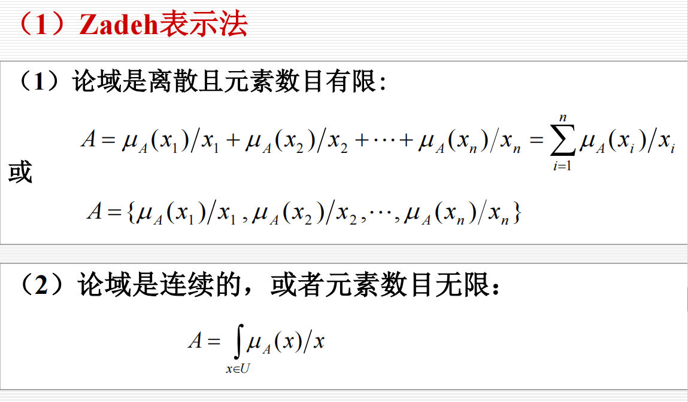

    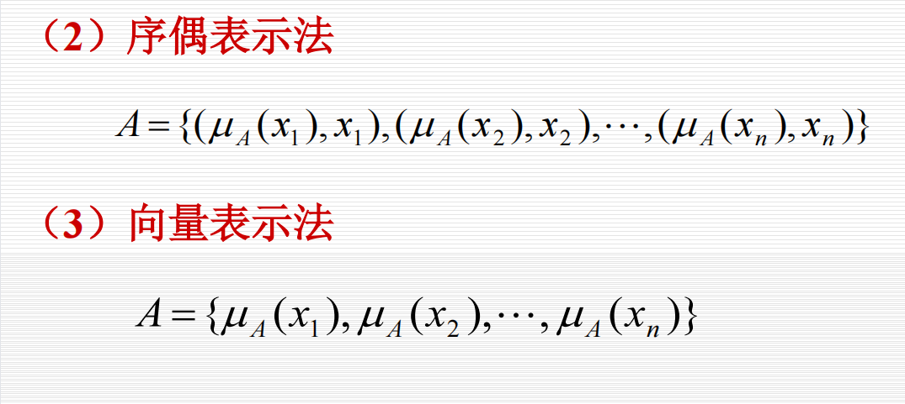

3. 隶属函数

    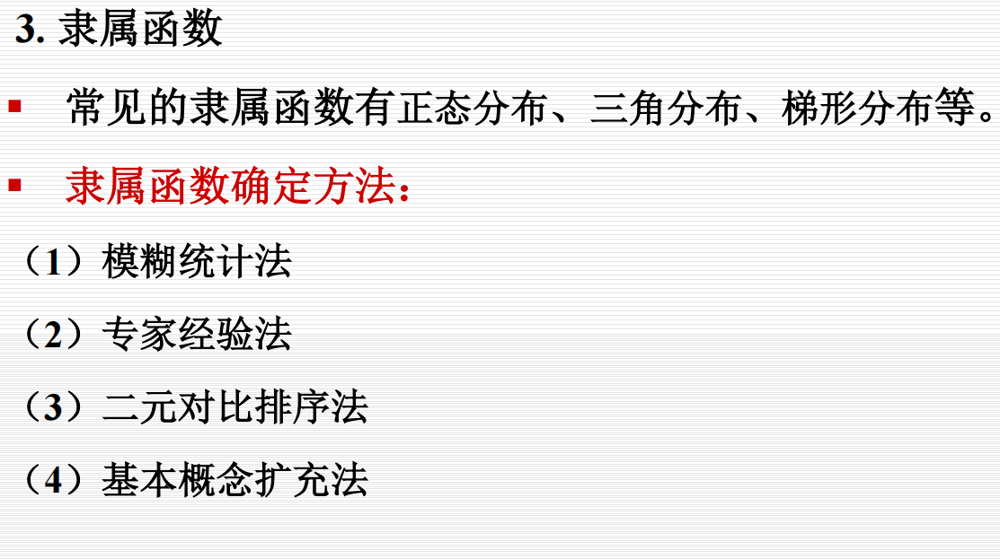

    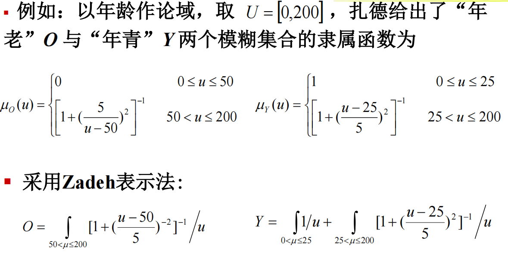

* **模糊集合的运算**

    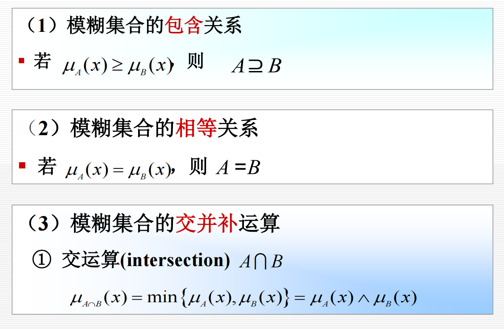

    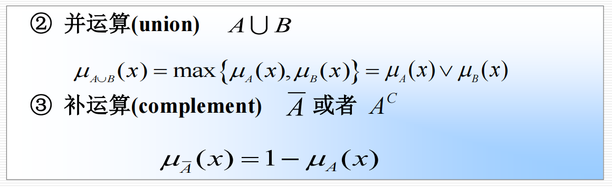

    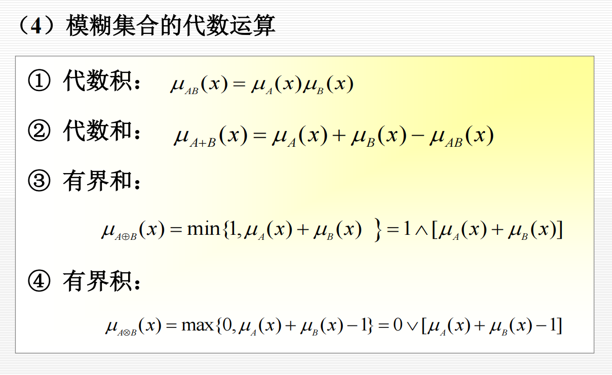

* **模糊关系与模糊关系的合成**

    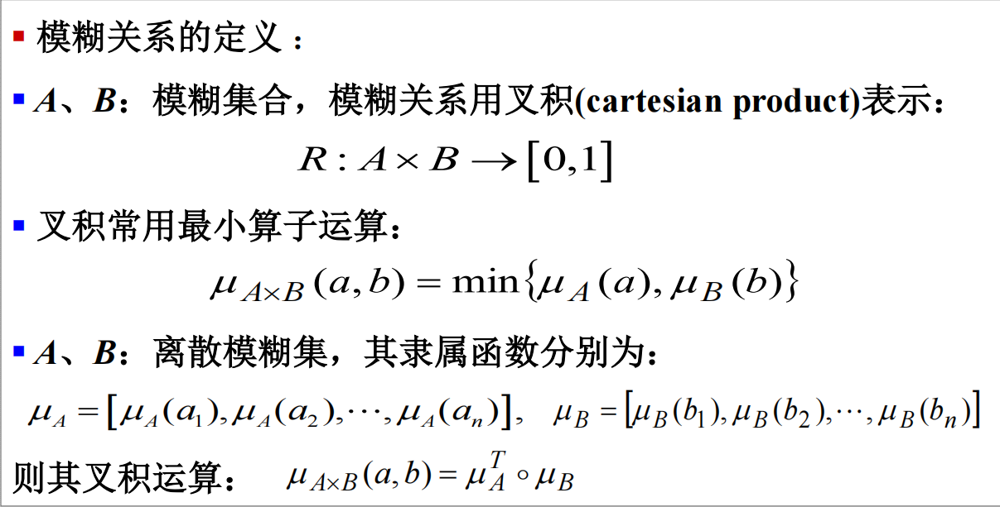

* **模糊推理**

1. 模糊知识的表示

    

2. 对 IF A THEN B 类型的模糊规则的推理

    

    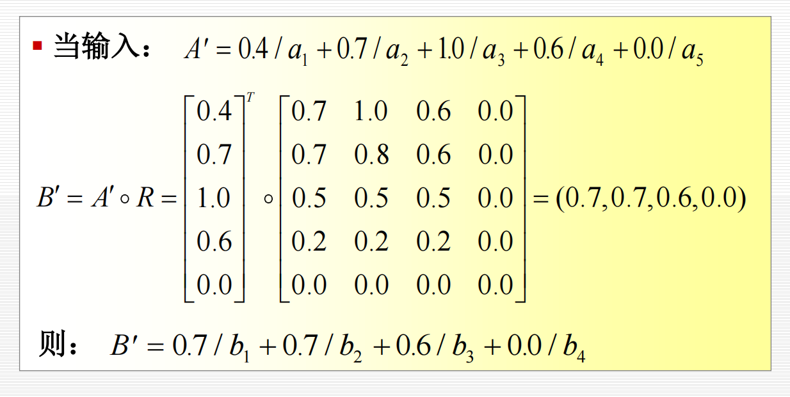
    其实就是×变且，+变或

* **模糊决策**

模糊决策(模糊判决、解模糊、清晰化)：由模糊推理得到的结论或者操作是一个模糊向量转化为确定值的过程。

1. 最大隶属度法

    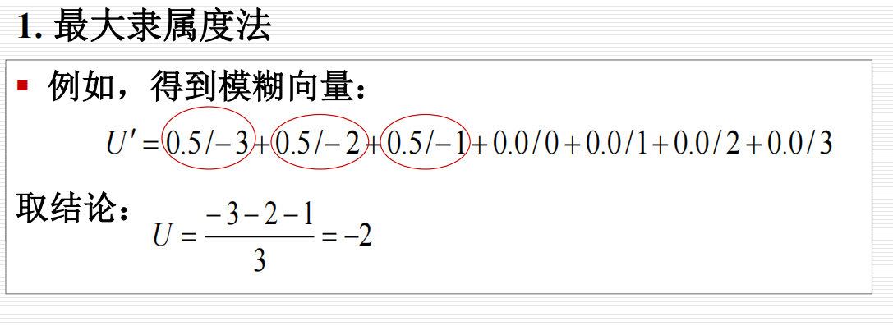

2. 加权平均判决法

    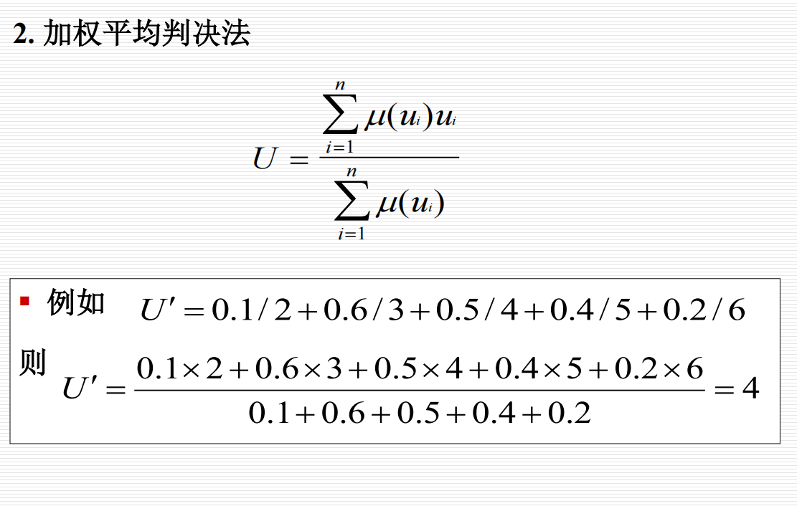

3. 中位数法

    论域上把隶属函数曲线与横坐标围成的面积平分为两部分的元素称为模糊集的中位数。

    中位数法就是把模糊集的中位数作为系统控制量。

    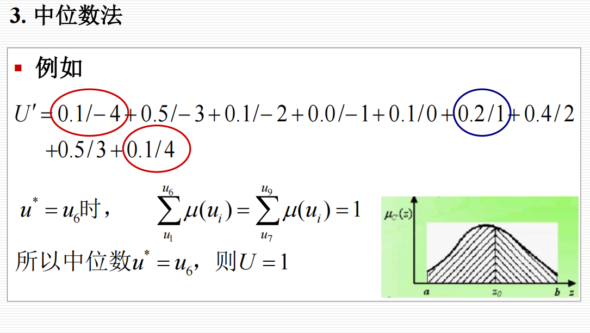

## ***搜索求解策略***

### ***搜索的概念***

### ***状态空间的搜索策略***

### ***盲目的图搜索策略***

### ***启发式图搜索策略***
