# 进程与线程

## 1.进程与线程

### 进程通信

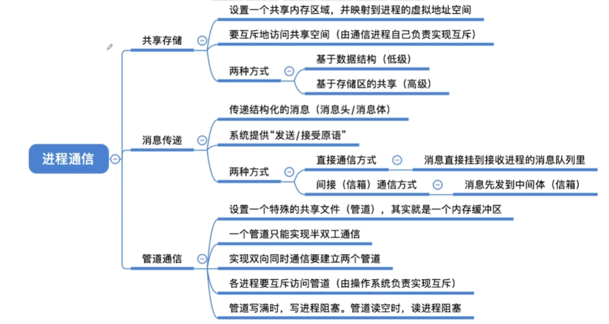

### 线程和多线程模型

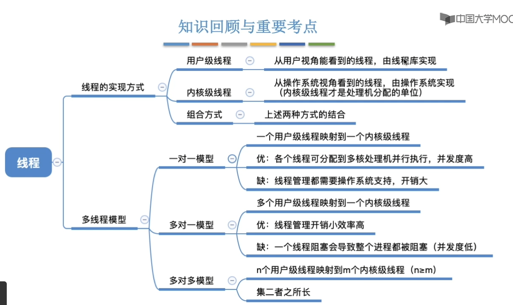

## 2.调度

### 调度的层次

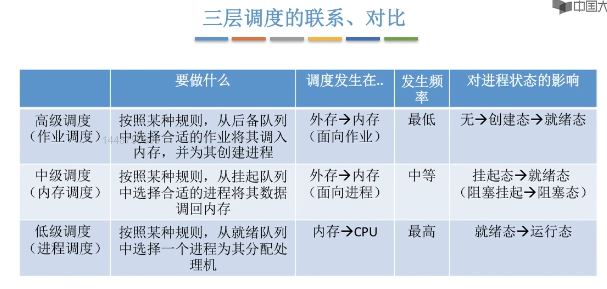

- 作业调度：给后背队列的作业分配内存等必要资源，建立相应进程，是面向作业的主存与辅存的调度。
- 内存调度：讲暂时不能允许的进程挂起（调至外存），或在内存有空闲时把已具备运行条件的进程重新载入内存。是面向进程的主存与辅存的调度。
- 进程调度：从就绪队列选择一个进程，把处理机分配给它，是CPU调度。
- 作业：一个具体的任务。

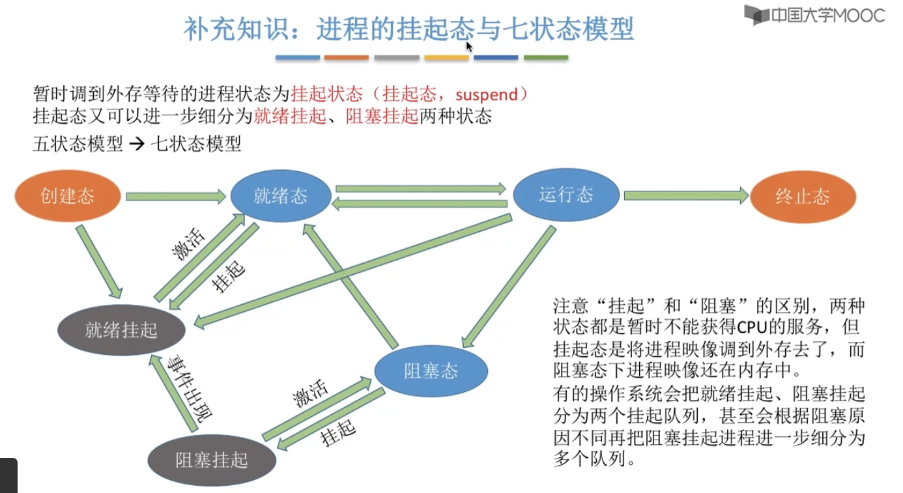

### 调度的时机、切换与过程

- 调度的时机：进程（主动或被动）放弃处理机时，需要用进程调度算法选择下一个占有处理机的进程。
    > 主动放弃处理机：进程正常终止、进程异常终止、进程阻塞  
    > 被动放弃处理机：分给进程的时间片用完、有更紧急的事要处理(比如中断)、有更高优先级的进程进入就绪队列
- 不能进行调度的情况：处理中断过程中、程序在操作系统内核程序临界区中、原语执行过程中
    > 注意：内核程序临界区不等于临界区。内核程序临界区一般是访问某种*内核数据结构*，比如进程就绪队列；临界区是指访问临界资源的那段代码。

补充说明

- 广义的进程调度包含进程选择和进程切换
- 进程选择：从就绪队列中选择一个要运行的进程。
- 进程切换：对原来进程的各种数据的保存，对新进程的各种数据的恢复。
- 进程切换是有代价的，过于频繁的进程调度会使整个系统的效率降低。

抢占式与非抢占式

- 抢占式：可由操作系统剥夺当前进程的CPU使用权
- 非抢占式：操作系统不能剥夺当前进程的CPU使用权

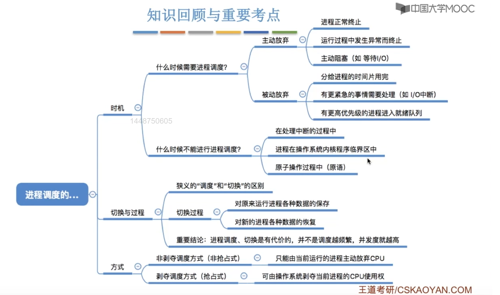

### 调度器和闲逛进程

调度器

- 调度器(scheduler)，又称调度程序，就绪态和运行态的转换由低调度程序决定。
- 调度算法决定谁来运行，时间片大小决定运行时长。
- 创建进程、进程退出、进程阻塞和IO中断时，会触发调度程序。
- 调度程序调度的对象是进程或内核级线程。（若内核级线程是调度的基本单位，则进程是资源分配的基本单位）。

闲逛进程

- 优先级最低、可以是零地址指令、占1个时钟周期、能耗低

### 调度算法评价指标

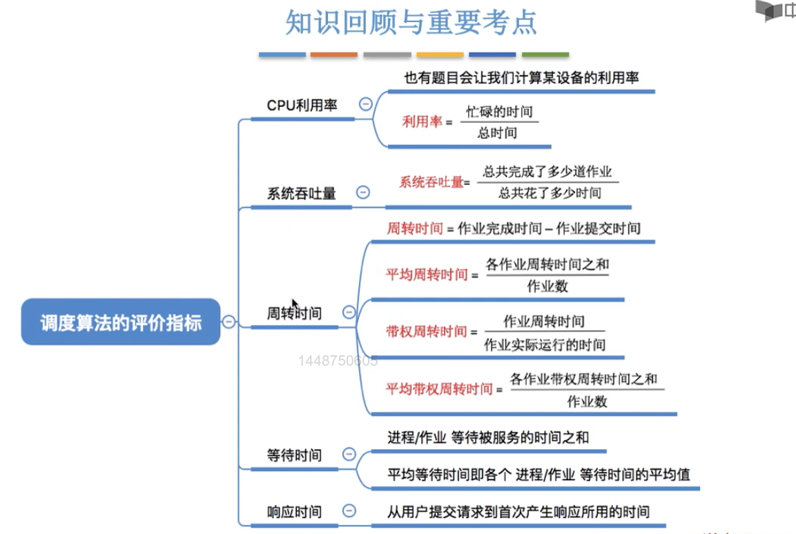

## 3.调度算法

### 先来先服务(FCFS)

先来先服务(FCFS, First come first serve)算法：每当需要调度时，选择等待时间最长的进程给予CPU使用权。

既可以用于作业调度，又可以用于进程调度。

- 优点：算法实现简单、公平、不会导致饥饿
- 缺点：排在长进程(作业)之后的短进程需要等待很长时间，带权周转时间大。对长进程有利，对短进程不利。

### 短作业优先(SJF)和最短剩余时间算法(SRTN)

短作业优先(Shortest job first)  
最短剩余时间算法(Shortest Remaining Time Next)

两个算法追求最少的平均等待时间、平均周转时间、平均带权周转时间。短作业优先算法是非抢占式，最短剩余时间算法是抢占式。

既可以用于作业调度，又可以用于进程调度。

在进程调度时，SJF又称为短进程优先算法(SPF,Shortest process first)

- 优点：“最短”的平均等待时间和平均周转时间
- 缺点：不公平。对短进程有利、对长进程不利。可能导致长进程饥饿。

### 高响应比优先算法(HRRN)

高响应比优先算法(Highest Response Ratio Next)

在每次调度时，选择相应比最高的进程占用CPU。  
响应比：(等待时间+要求服务时间)/要求服务时间

既可以用于作业调度，又可以用于进程调度。

非抢占式算法。

- 优点：综合考虑了等待时间和运行时间，等待时间相同时，运行时间短的进程优先；运行时间相同时，等待时间长的进程优先。对于长作业而言，随着等待时间越来越久，响应比越来越大，从而避免了长进程饥饿的问题。
- 缺点：NULL

### 时间片轮调度算法(RR)

时间片轮(Round-Robin)

公平地、轮流地为各个进程服务，让每个进程在一定时间内都可以得到响应。该算法一般用于分时操作系统。

只用于进程调度，因为只有进程才占用CPU。

是一种抢占式算法。

- 优点：公平、不会导致饥饿
- 缺点：高频率的切换进程，有一定的额外开销；不区分任务的紧急程度。

> 补充：  
> 若时间片过大，则时间片轮调度算法退化为先来先服务算法，且会增大进程响应时间(指响应中断的间隔过长等情况)。  
> 若时间片过小，则进程切换过于频繁，带来额外的进程切换开销，导致进程实际运行时间的比例减少。  
> 一般来说，设置的时间片应使进程切换的开销不超过1%

### 优先级调度算法

一般应用于实时操作系统，根据任务的紧急程度决定处理顺序。

每个作业/进程都有优先级，调度时选择优先级最高者。

既可用于作业调度，又可用于进程调度，还可用于IO调度。

抢占式实现和非抢占式实现都有。抢占式实现需在就绪队列发生变化时判断是否调度。

> 通常，前台进程优先级高于后台进程，系统进程高于用户进程。OS更偏向IO繁忙进程(因为IO设备可以和CPU并行工作，让IO繁忙进程优先运行的话，IO设备可以尽早投入工作，有利于提高系统吞吐量、资源利用率)。  
> 如果某进程在就绪队列等待了很长时间，可以适当提升其优先级‘某进程占用了cpu很长的时间，可以适当降低其优先级。

- 优点：用优先级区分紧急程度、重要程度，适用于实时操作系统。可以灵活调整对作业/进程的偏好程度。
- 缺点：可能导致饥饿（若源源不断的有高优先级进程进入就绪队列）

### 多级反馈队列调度算法

是对前面几种算法的折中权衡，只用于进程调度。

1. 设置多级队列，各级队列优先级从高到低，时间片从小到大。
2. 新进程到达时先进入第1级队列，按FCFS原则排队等待被分配时间片，若用完时间片进程还未结束，则进程进入下一级队列队尾。如果此时已经是在最下级的队列，则重新放回该队列队尾。
3. 只有第k级队列为空时，才会为 k+1 级队头的进程分配时间片

是抢占式算法。在k级队列运行过程中，若更上级队列(1~k-1)中进入了一个新进程，则由于新进程优先级较高，新进程会抢占处理机，原来运行的进程放回k级队列的队尾。

- 优点：对各类进程相对公平；每个新到达的进程都可以很快得到响应；短进程只用较少的时间就可以完成；不必实现估计进程的运行时间(避免用户造假)，可灵活调整对各类进程的偏好程度(比如，可以将因IO阻塞的进程塞回原队列，使IO进程保持较高优先级)
- 缺点：可能导致饥饿(比如，有源源不断的新短进程)

### 多级队列调度算法

系统中按进程类型设置多个队列，进程创建成功后插入某个队列。

> 比如，设置三个队列：系统进程队列、交互式进程队列、后台进程队列。优先级依次降低。至于每个队列当中应该如何调度，可以用之前的几个算法。

## 4.同步与互斥

### 同步与互斥的基本概念

- 临界资源：将一次仅允许一个进程使用的资源称为临界资源
- 同步：又称直接制约关系，指为完成某种任务二建立的两个或多个进程，这些进程因为需要再某些位置上协调它们的工作次序而等待、传递信息所产生的制约关系。
    > 通俗来讲，同步是指多个进程的指令有执行的先后顺序要求，需用同步机制保证顺序不出错
- 互斥：也称间接制约关系。当一个进程进入临界区使用临界资源时，另一个进程必须等待，党占用临界资源的进程退出临界区后，另一进程才允许访问此临界资源。

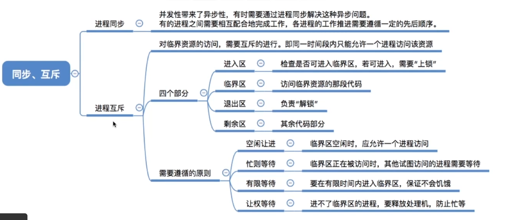

### 软件实现临界区互斥

- *单标志法*  
    公用整型变量turn表示被允许进入临界区的进程变换。  
    缺点是，两个进程必须交替进入临界区，且不满足空闲让进、有限等待和让权等待。
- *双标志先检查*  
    在每个进程访问临界资源前，先查看临界资源是否被访问，若正被访问，则该进程等待；否则，该进程进入临界区。  
    优点是，不需交替进入，同一进程可以连续使用临界区。  
    缺点是，可能在时间片轮转时，有多个进程都检测到临界区未被访问，然后都进入临界区。
- *双标志后检查*  
    先将自己的标志设为true，再检查对方状态，若对方标志为true，则等待，否则进入临界区。  
    优点是，不需交替进入，同一进程可以连续使用临界区。  
    缺点是，在两个进程几乎同时想进入临界区时，分别将自己的标志flag设为true，又检测到对方的标志为true，双方都无法进入临界区，导致死锁。
- *Peterson's Algorithm*  
    为防止两个进程为进入临界区而无限期等待，又设置了变量turn，每个进程先设置自己的标志再设置turn标志。这时，再同时检测另一个进程状态标志和允许进入标志，以便保证两个进程同时要求进入临界区时，只允许一个进程进入临界区。  
    缺点：不满足 让权等待。  
    > 通俗理解，进程P0要进入临界区，先说我要用(flag[0]=true)，并表达我可以等你先用(turn=1)，如果最后发现是有其他进程要用且该进程最后谦让，则该进程不能进入，反之可以进入。

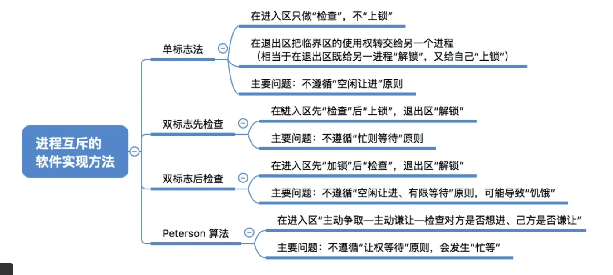

### 硬件实现临界区互斥

- 中断屏蔽法  
    关中断，处理器不会切换进程，保证临界区代码顺利执行。  
    缺点：不支持多处理机(关中断)，不支持用户进程(用户进程不能转到内核态)，
- TestAndSet指令  
    TestAndSet指令是原子操作，功能是读出指定标志后把该标志设为真。  
    可为每个临界资源设置一个共享布尔变量lock，lock=true表示资源正在被占用。在进程进入临界区之前，利用TestAndSet检查标志lock，若无进程在临界区，则返回值为false，可以进入，并且lock置true；若有进程在临界区，则循环检查。
- Swap指令  
    Swap是原子操作，功能是交换两个字的内容。  
    为每个临界资源设置一个共享型布尔变量lock，初值为false；在每个进程中再设置一个布尔型变量key，用于与lock交换信息。在进入临界区前，利用Swap交换lock与key的内容，然后检查key的状态。

TestAndSet指令法和Swap指令法又称硬件指令方法。  
硬件指令方法的优点：适用于任意数目的进程，适用于多处理机；简单、容易验证其正确性。支持进程有多个临界区，只需为每个临界区设置一个布尔变量。  
硬件指令方法的缺点：进程等待进入临界区时要耗费处理机时间，不满足让权等待。从等待进程中随机选择一个进入临界区，有的进程可能一直选不到，导致饥饿。

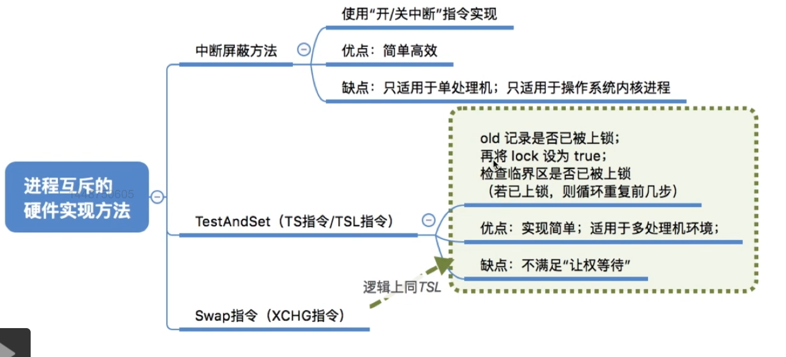

## 5. 信号量

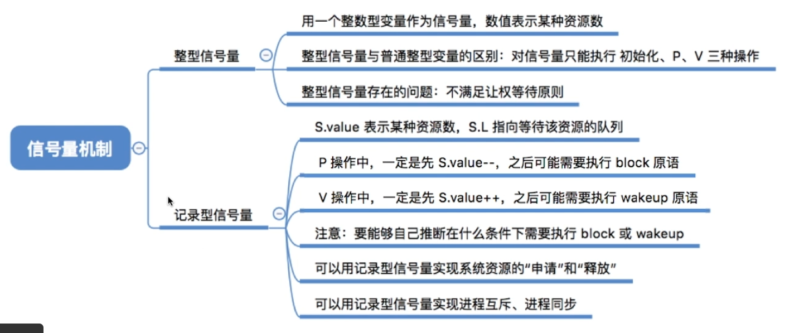

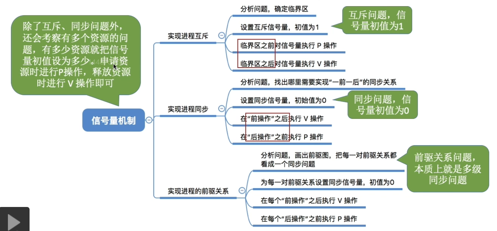

## 6. 生产者-消费者问题

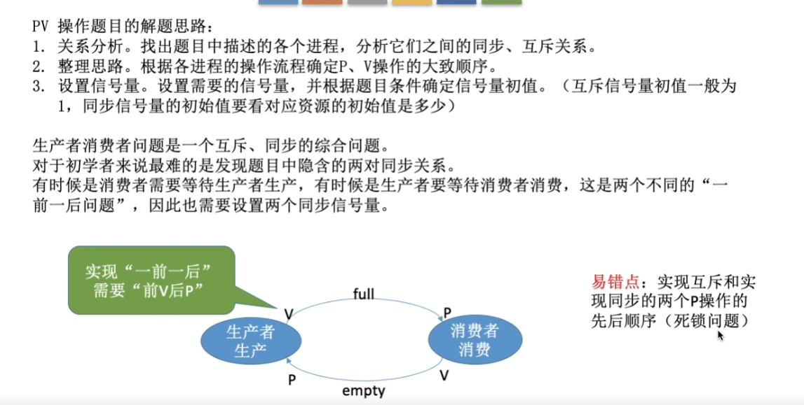

## 7. 多生产者-多消费者问题

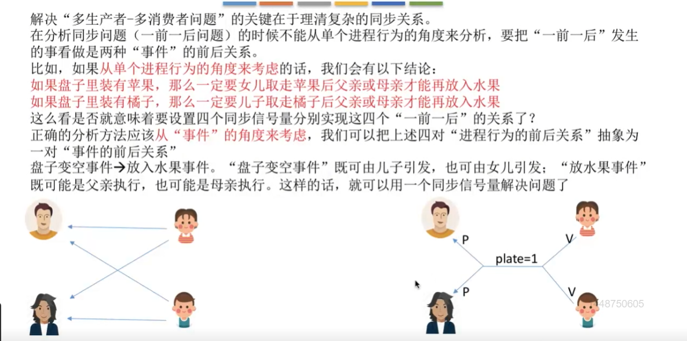

## 8. 吸烟者问题

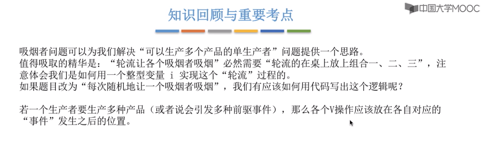
