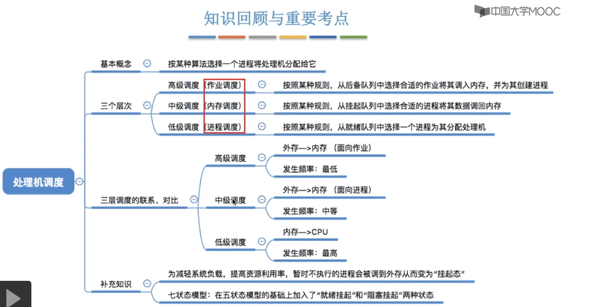

# 进程与线程

## 1.进程与线程

### 进程通信

### 线程和多线程模型

## 2.调度

### 调度的层次

- 作业调度：给后背队列的作业分配内存等必要资源，建立相应进程，是面向作业的主存与辅存的调度。
- 内存调度：讲暂时不能允许的进程挂起（调至外存），或在内存有空闲时把已具备运行条件的进程重新载入内存。是面向进程的主存与辅存的调度。
- 进程调度：从就绪队列选择一个进程，把处理机分配给它，是CPU调度。
- 作业：一个具体的任务。

