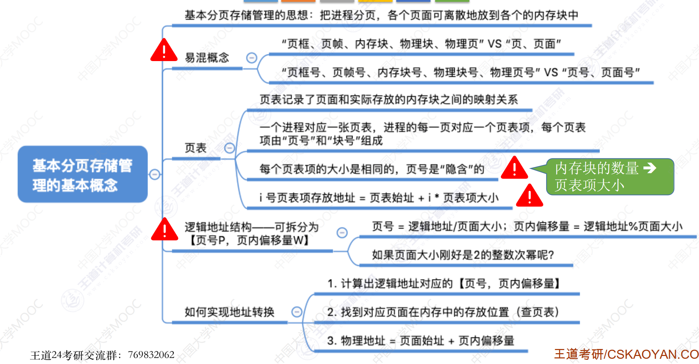
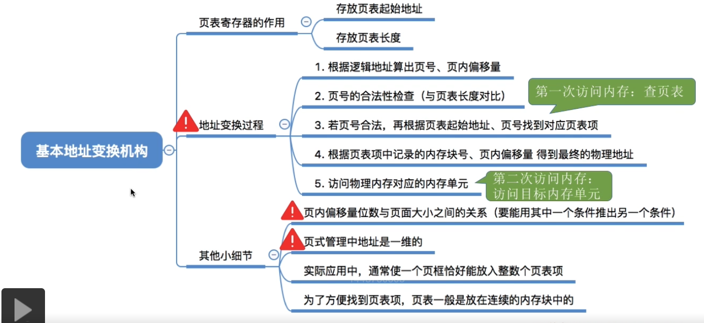
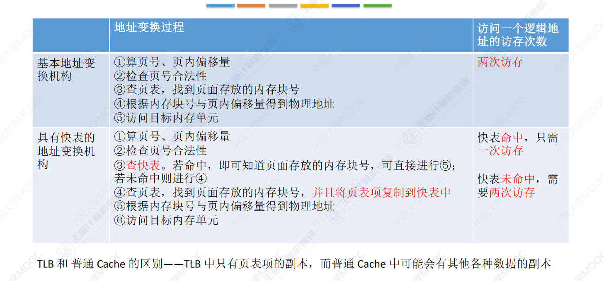
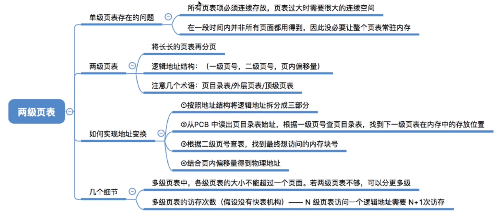
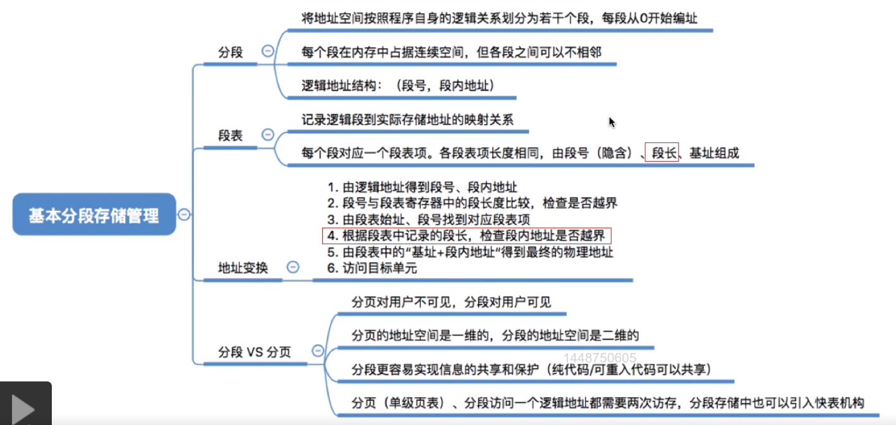
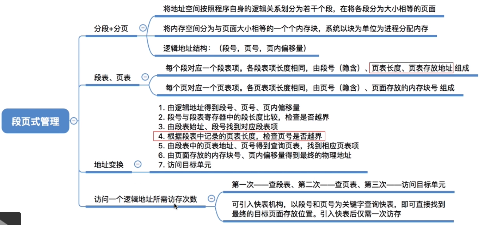
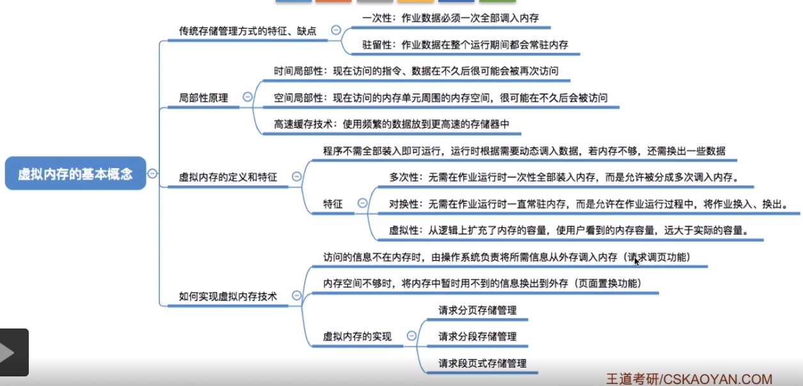
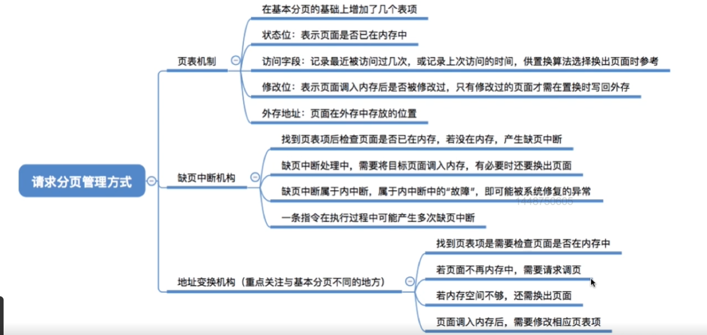
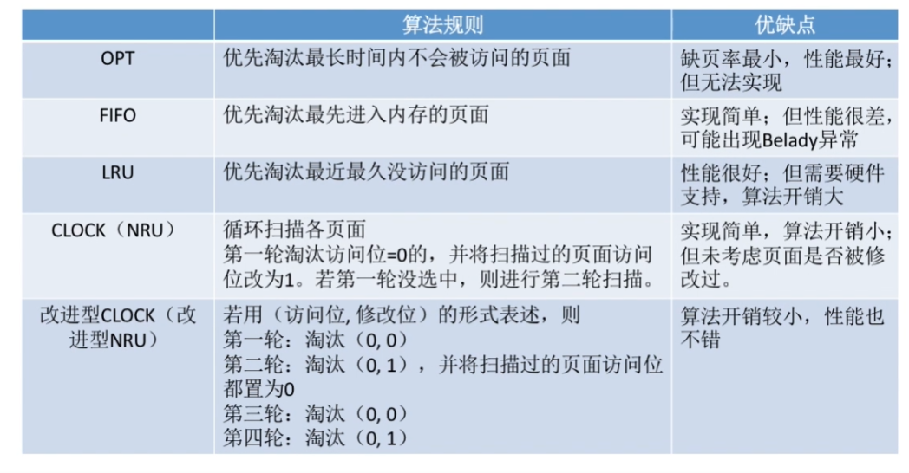

# 基本内存管理

## 1. 内存基本知识

内存管理：
1. 内存空间的分配与回收
2. 内存空间的扩充(虚拟内存)
3. 地址转换
    > 操作系统实现逻辑地址到物理地址的转换。  
    > 绝对装入、**可重定位装入**、**动态运行时装入**
4. 存储保护
    > 保证各个进程在自己的内存空间运行，不会越界访问。  
    > 设置上下限寄存器；利用重定位寄存器、界地址寄存器。

## 2. 内存空间的分配与回收

### 连续分配管理方式

连续分配管理：为用户进程分配一个连续的内存空间。

**动态分区分配算法**

- 首次适应算法(First Fit)：每次从低地址开始查找，找到第一个能满足大小的空闲分区。
- 最佳适应算法(Best Fit)：优先使用尽可能小的空闲分区。
    > 缺点：产生很多外部碎片。
- 最坏适应算法(Worst Fit)：优先使用最大的空闲分区。
    > 缺点：可能导致内存需求大的进程没有内存分区可用。
- 邻近适应算法(Next Fit)：从上次查找结束的位置开始查找空闲分区，找到大小能满足的第一个分区

### 分页存储管理

### 分段存储管理

- 段式存储管理的优点：方便变成、分段共享、分段保护、动态链接和动态增长。

### 段页式存储管理

*概念辨析*

- 页框=页帧=内存块=物理块=物理页面，指的是内存的一个分区。
- 页框号=页帧号=内存块号=物理块号=物理页号，指的是页框的编号。
- 页=页面，指的是进程的逻辑地址空间的一个分区。
- 页号=页面号，指的是进程的逻辑地址空间的一个分区的编号。

***个人总结：***
1. 页式存储管理是把物理内存分成若干个大小相等的页框，那么进程的逻辑地址空间也要相应的分为若干个大小相等的页，从而将逻辑地址与物理地址一一对应。逻辑地址由 页号+页内偏移量 构成。每个页对应一个页表项，每项的长度相同，由 页号(隐藏)+页框号 构成。
2. 段式存储管理是把进程按代码模块分成若干个(大小不一定相等)段，在装入内存时以段为单位装入。逻辑地址由 段号+段内偏移量 构成。每个段对应一个段表项，各项长度相同，由 段号(隐含)+段长+段基址 构成。这样的好处是方便信息的共享和保护。
3. 段页式存储管理是先分段，各段再分页放入内存。逻辑地址由 段号+页号+页内偏移量 构成。每个段对应一个段表项，每个段表项长度相同，段表由 段号(隐含)+页表长度+页表存放地址 组成。每个页对应一个页表项，各页表项长度相同，页表由 页号(隐含)+存放页面的内存块号 组成。
4. 段号位数决定了一个进程最多分成几段、页号位数决定了每段最多有多少页，页内偏移量位数决定了页面和页框大小。

> **补充知识**(好像已经从考纲中移除了)
> - 静态装入：在变成阶段就把物理地址计算好
> - 可重定位：在装入内存时把逻辑地址转换为物理地址。装入后地址不能再改变。
> - 动态重定位：再执行时再决定装入的地址并装入，装入后可以会换出，故同一个模块再内存中的物理地址是可能改变的。地址的转换通过硬件实现(MMU)

## 3. 内存空间的扩充

### 覆盖技术与交换技术

# 虚拟存储技术

## 虚拟内存基本概念

## 请求分页管理方式

## 内存置换算法

