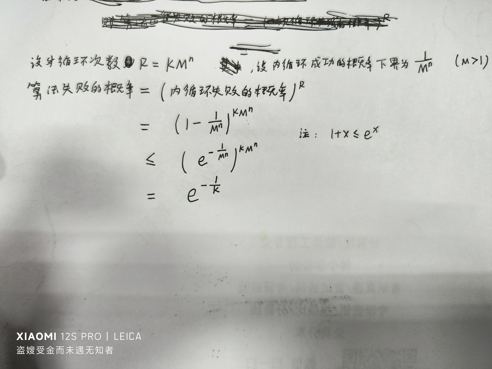
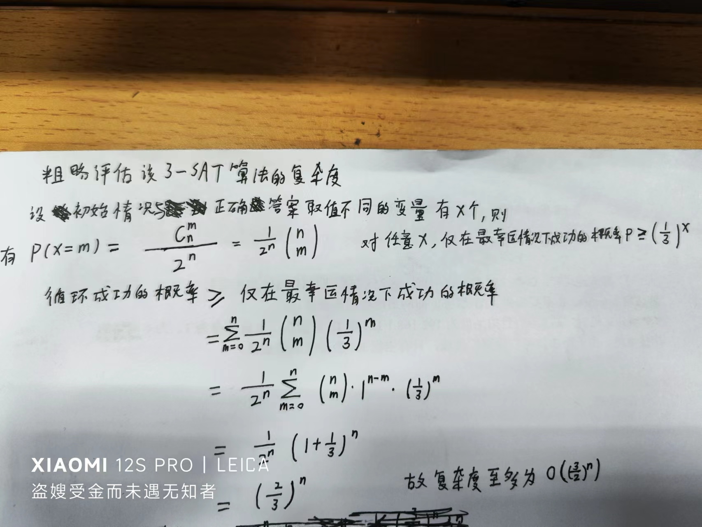
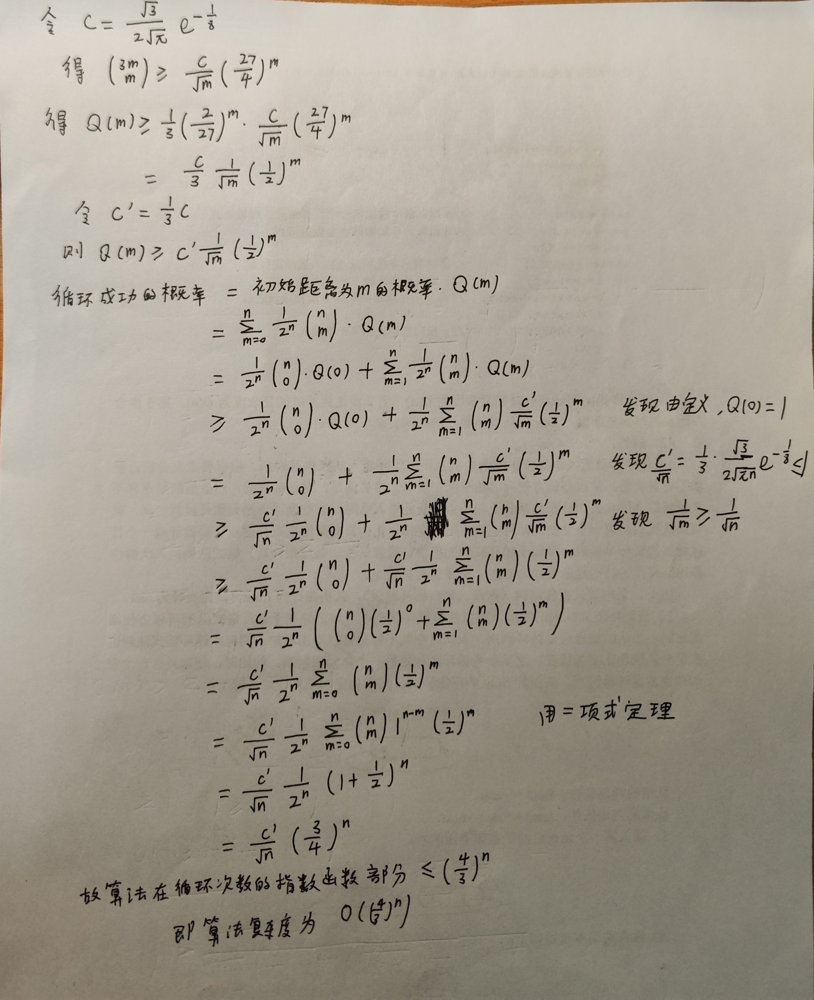
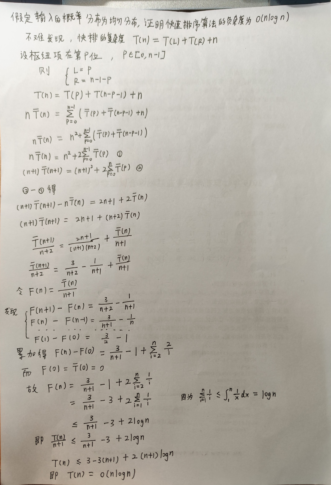
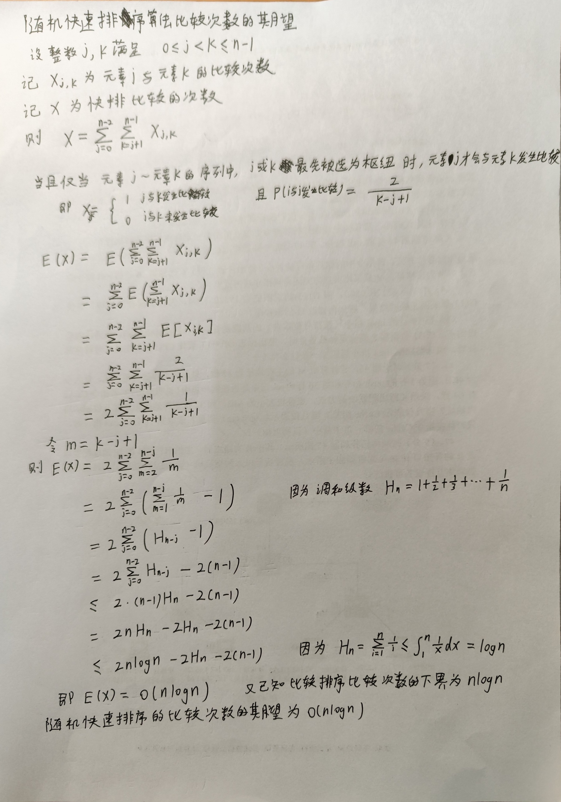

# 数学女孩4：随机算法

## 钢琴问题

## 可满足性问题(Satisfiability Problem)

1. 组成逻辑公式的元素是拥有"真"值或"假"值的*变量*
2. "变量"或者"¬变量"称作literal(字面量)
3. 用∨连结字面量，由此形成的整体称作clause(字句)
4. 将括号内的字句用∧连结，形成的整体称为*逻辑公式*。逻辑公式又称合取范式，它的简写为CNF(Conjunctive Normal Form)
    > 若逻辑公式的每个字句都由三个字面量构成，则称这个逻辑公式是3-CNF  
    > 我们把调查 "是否存在分配方式满足3-CNF" 的问题称作"3-SAT"
5. 决定赋予变量"真"值还是"假"值的对应关系称作*分配方式*
    > 当分配方式a使逻辑公式f为真命题时，我们可以说，分配方式a*满足*逻辑公式f

### NP完全问题

1. P问题：  
   假设有一个规模为n的问题，如果我们能在多项式时间内找到问题正确的解，就把这个问题称为P问题。  
   所有可以在多项式时间内求解的判定问题构成P类问题。
    > P是指多项式时间，即 Polynomial time
2. NP问题：  
   对于一个规模为n的问题，当得到解的候选时，能够在多项式时间内***判断***候选是否为问题正确的解。  
   所有的非确定性多项式时间可解的判定问题构成NP类问题。
    > NP是指 Non-deterministic Polynomial time，即非确定多项式时间  
    > 目前，人们已证明了所有的P问题都说NP问题。  
    > 非确定性算法：非确定性算法将问题分解成猜测和验证两个阶段。算法的猜测阶段是非确定性的，算法的验证阶段是确定性的，它验证猜测阶段给出解的正确性。
3. P≠NP猜想：并非所有NP问题都是P问题
    > 也即，'即使我们能高效的*判定*问题的解，也未必能高效的*找出*问题的解'
4. **NP完全问题**  
    NP中的某些问题的复杂性与整个类的复杂性相关联。这些问题中任何一个如果存在多项式时间的算法，那么所有NP问题都是多项式时间可解的。这些问题被称为NP-完全问题(NPC问题)。  
    只要证明NP完全问题中的任意一个问题为P问题，人们就能证明所有的NP问题都是P问题，也就是P=NP。
    > 可满足性问题(SAT)是历史上第一个被判定为NP完全问题的问题。

### 随机算法

**求解可满足性问题(3-SAT)的随机算法：**

输入：  
逻辑公式(3-CNF)f；  
变量的个数n；  
循环次数R

输出：  
在R轮循环中，  
当找到满足逻辑公式f的分配方式时，输出"可以满足"。
没有找到满足逻辑公式f的分配方式时，输出"大概无法满足"。

伪代码：

```cpp
// f:逻辑公式；n:变量个数；R：循环次数
procedure RANDOM-WALK-3-SAT(f,n,R)
    r = 0
    while r < R do
        a = <随机选取拥有n个变量的分配方式>
        k = 0
        while k < 3*n do
            if<分配方式a满足逻辑公式f> then
                return "可以满足"
            end-if
            c = <由逻辑公式得到分配方式a不满足的子句>
            x = <从子句c中随机选取变量>
            a = <对分配方式a的变量x进行非运算得到新的分配方式>
            k = k+1
        end-while
        r = r+1
    end-while
    return "大概无法满足"
end-procedure
```

3-SAT随机算法失败的概率


粗略估计3-SAT算法的复杂度


> 钢琴问题的一般解：  
> 旋律不使用比开始音低的音；旋律由a+b个音组成；每个音都与临近的音相连；旋律的终止音只比开始音高a-b-1个音阶。满足这些条件的旋律的个数可以用下面的式子表示：
> (a-b)/(a+b) × ((a+b)!/(a!b!))

***精确评估3-SAT算法的复杂度***



## 快速排序

快速排序平均情况下复杂度分析


随机快速排序比较次数的期望

